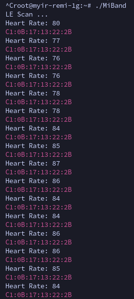

# 小米手环6广播数据接收`Linux`端（C语言实现）

这一版本的可以正常实现接收小米手环的蓝牙广播数据，注意，接收广播数据并不需要和小米手环进行连接，只要能够正常的发现手环的蓝牙设备就可以。
需要注意的一个地方就是，小米手环属于低功耗蓝牙设备，就是我们所知道的BLE设备，所以用传统的方法无法实现扫描到该设备的信息。

实现的效果如图


硬件设备的需求就是，只要有`Linux`系统的`bluez`工具就可以了，在运行代码之前，可以先使用`Linux`上的蓝牙管理命令行工具`bluetoothctl`，看看能不能检测到低功耗蓝牙设备，如果检测不到也不要慌张，可以修改一下`bluetoothctl`的配置

## 修改`bluetoothctl`扫描低功耗设备

```
bluetoothctl
```
```
menu scan
```
```
transport le
```
```
back
```
```
scan on
```
这样应该就可以用bluetoothctl检测到蓝牙低功耗设备了。